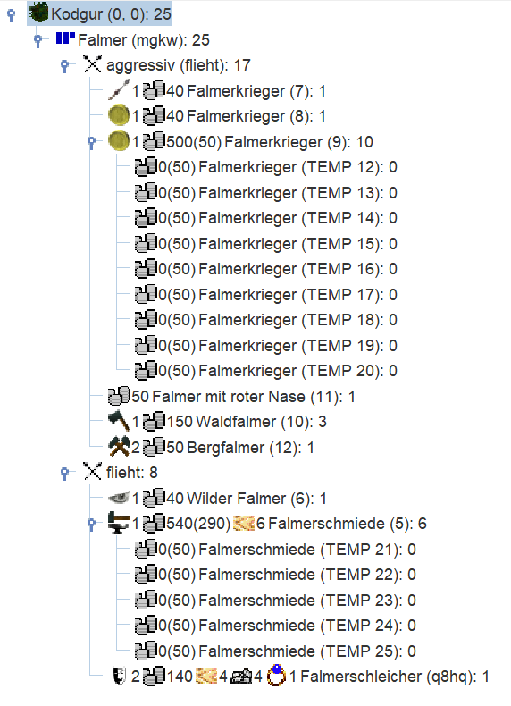
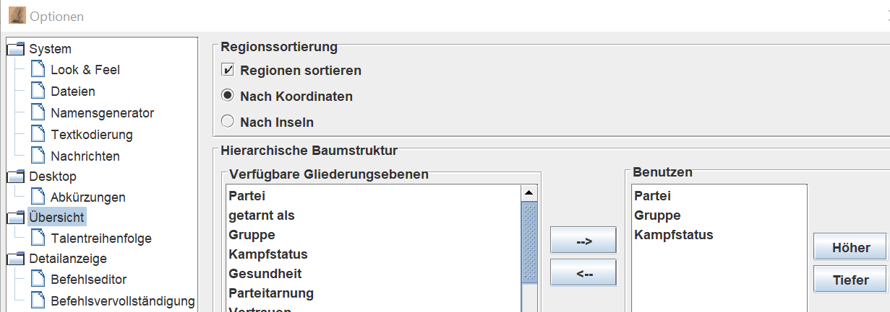

# Runde 2

## Die Auswertung

Die zweite Auswertung ist da.
Wir gucken uns zunächst nochmal den Kopf der Auswertung an. 

Der Wechsel unseres Parteinames hat offenbar funktioniert, denn wir finden hier nun den neuen Namen "Falmer" für unser Goblinvolk. Die Parteinummer hatten wir nicht geändert, also ist diese nach wie vor "mgkw". Ein Magiegebiet hatten wir ebenfalls noch nicht gewählt. 
Außerdem haben wir jetzt 25 Personen in 9 Einheiten von bis zu 2500 maximal möglichen Einheiten; also nocht reichlich Luft um zu wachsen. 
```
        Falmer (mgkw), Goblins/Kein Magiegebiet (goblinplayer@drachensgrab.de)
         Bitte denke daran, deine Befehle mit dem Betreff ERESSEA 1 BEFEHLE an
                          tutorial@drachensgrab.de zu senden.

                 Deine Partei hat 25 Personen in 9 von maximal 2500 Einheiten.
```
Außerdem haben die beiden Bereiche "Hinweise" und "Ereignisse" in unserem Report. Dort lesen wir, dass wir jetzt nur noch 5 Wochen immun sind und das wir unser Passwort auf etwas einprägsameres geändert haben. Wenn wir den Report in Magellan zu dem Report der vorherigen Runde hinzufügen, dann fragt uns Magellan automatisch, ob wir das neue Passwort direkt übernehmen wollen. Wenn man seinen Zug händisch schreibt, muss man in jedem Fall darauf achten, dass man das neue Passwort benutzt.
```
                                       Hinweise

    Deine Partei ist noch die nächsten 5 Wochen immun gegen Angriffe.

                                      Ereignisse

    Das Passwort für diese Partei lautet GoblinsSindEinKulturvolk.
```
Der spannendste Teil ist aber sicherlich der detailierte Blick in unseren Heimatwald Kodgur. Dort stehen weiterhin 500 ausgewachsene Bäume und 100 Schösslinge. Da wir rekrutiert haben, hat sich die Bauernzahl leicht nach unten verändert. Die Preise für Luxusgüter sind unverändert geblieben, können uns aber auch weiterhin egal sein, da wir weder Handelsposten noch Händler haben. Die Anzahl der maximalen Rekruten in Kodgur hat sich leicht verändert. Es können jetzt nur noch 99 Bauern rekrutiert werden. Das sind (abgerundet) 2.5% der Regionsbevölkerung. Wie wir schon im oberen Teil der Auswertung lesen konnten, haben wir nun 9 Einheiten mit insgesamt 25 Personen, die im Detail aufgelistet werden.

    Kodgur (0,0), Wald, 500/100 Bäume, 3993 Bauern, 87909 Silber, 52 Pferde. Im
    Nordwesten der Region liegt das Hochland von Gosnad (-1,1), im Nordosten Ozean
    (0,1), im Osten Ozean (1,0), im Südosten Ozean (1,-1), im Südwesten Ozean
    (0,-1) und im Westen das Bergland von Sorogokal (-1,0).
    
    Auf dem Markt wird für Juwelen 7 Silber verlangt. Geboten wird für Balsam 20
    Silber, für Gewürze 20 Silber, für Myrrhe 30 Silber, für Öl 15 Silber,
    für Seide 30 Silber und für Weihrauch 20 Silber.
    
    Statistik für Kodgur (0,0):
    
      Unterhaltung: max. 4395 Silber
      Lohn für Arbeit: 10 Silber
      Rekruten: max. 99 Bauern
      Luxusgüter zum angegebenen Preis: 39
      Personen: 25
      Holz: 10
      Silber: 1550
      Ringe der Unsichtbarkeit: 1
      Steine: 4
    
      * Falmerschleicher (q8hq), 1 Höhlengoblin, flieht, Talente: Tarnung 2, hat:
        4 Holz, 140 Silber, Ring der Unsichtbarkeit, 4 Steine, "LERNE AUTO
        Tarnung".
    
      * Falmerschmiede (5), 6 Höhlengoblins, flieht, Talente: Waffenbau 1, hat: 6
        Holz, 540 Silber, "LERNE AUTO Waffenbau".
    
      * Wilder Falmer (6), 1 Höhlengoblin, flieht, Talente: Wahrnehmung 1, hat:
        40 Silber, "LERNE Wahrnehmung".
    
      * Falmerkrieger (7), 1 Höhlengoblin, aggressiv, Talente: Stangenwaffen 1,
        hat: 40 Silber, "LERNE AUTO Stangenwaffen".
    
      * Falmerkrieger (8), 1 Höhlengoblin, aggressiv, Talente: Steuereintreiben
        1, hat: 40 Silber, "LERNE AUTO Steuereintreiben".
    
      * Falmerkrieger (9), 10 Höhlengoblins, aggressiv, Talente: Steuereintreiben
        1, hat: 500 Silber, "LERNE AUTO Steuereintreiben".
    
      * Waldfalmer (10), 3 Höhlengoblins, aggressiv, Talente: Holzfällen 1, hat:
        150 Silber, "LERNE AUTO Holzfällen".
    
      * Falmer mit roter Nase (11), 1 Höhlengoblin, aggressiv, Talente:
        Unterhaltung 0, hat: 50 Silber, "LERNE AUTO Unterhaltung".
    
      * Bergfalmer (12), 1 Höhlengoblin, aggressiv, Talente: Bergbau 2, hat: 50
        Silber, "LERNE AUTO Bergbau".

Die erste Einheit "Falmerschleicher" ist unsere Starteinheit von letzter Runde. Sie beinhaltet jetzt aber nicht mehr 10 sondern nur noch 1 Person, da wir ja die übrigen 9 Personen in andere Einheiten verteilt haben. Alle unsere Einheiten haben erfolgreich einmal gelernt. Beim Lernen zu Talentstufe 1 steigt man immer beim ersten Lernversuch auf, vorausgesetzt man hat kein Talentmalus.

Wir sehen also, dass unser Falmerschleicher jetzt Tarnung 2 beherrscht. Er ist mit einem LErnversuch direkt auf Stufe 1 gestiegen und Goblins haben zusätzlich einen Talentmodifikator von +1 auf Tarnung. Also hat dieser Goblin direkt Tarnung 2.

Die Falmerschmiede, wilder Falmer, die Falmerkrieger-Einheiten und die Waldfalmer sind alle auf Stufe 1 in ihrem jeweiligen Talent aufgestiegen. Goblins haben auf Waffenbau, Wahrnehmung, Stangenwaffen, Steuereintreiben und Holzfällen keine Talentmodifikation. Einmal Lernen bringt also immer garantiert Talentstufe 1 hervor.

Anders bei unserem Falmer mit roter Nase: Dieser hat auch einen Lernversuch ist aber weiterhin Stufe 0. Warum ist das so? Goblins haben auf Unterhaltung einen Talentmodifikator von -1. Die Einheit ist also beim ersten Lernversuch eigentlich auch direkt auf Stufe 1 aufgestiegen, dann greift aber der Talentmalus und die Einheit ist effektiv weiterhin auf Stufe 0. Die Einheit muss weiter lernen und eigentlich Stufe 2 erreichen, um dann effektiv Unterhaltung 1 zu beherrschen. Das Lernen bis auf Stufe 2 hängt vom Zufall ab. Generell gilt der Aufstieg bis zur nächsten Stufe kann zwischen 1 und 2x(nächste Stufe)-1 Runden dauern. Also konkret bei unserem Unterhalter, der bis Stufe 2 lernen soll, zwischen einer und 3 Runden (2x2-1) dauern. Im Mittel sollte der Aufstieg aber immer Anzahl (nächste Stufe) Runden dauern.

Unser Bergfalmer ist wie der Tarner direkt auf Bergbau Stufe 2 aufgestiegen, da wir einen +1 Bonus auf Bergbau haben. An dieser Stelle ist es wichtig, nochmal genau die Regionsbeschreibung zu lesen. Denn wir haben nun eine Einheit in der Region mit Bergbau 2, d.h. wir könnten Eisenvorkommen bis Stufe 4 (2x Talentstufe) entdecken. Leider stellen wir fest, dass es in Kodgur kein Eisen gibt. Schade, das hätte uns sehr geholfen schneller mehr Waffen zu bauen.    


## Der grobe Plan
Der Plan ist weiterhin einfach. Wir müssen Silber verdienen können!

Aktuell können wir noch keine Waffen bauen, weil unsere Schmiede nur Waffenbau 1 haben. Für Speere oder Bögen brauchen wir aber Stufe 2. Die Waffenbauer lernen also weiter. Ebenso wie praktisch alle anderen Einheiten auch. Die Steuereintreiber sollen im idealfall Stufe 2 erreichen, damit sie direkt mehr Silber eintreiben können. Wir müssen zwar auch noch ein Waffentalent erlernen, aber das können wir in derselben Runde machen, in der wir die Waffen bauen. Der Wahrnehmer wird sowieso permanent lernen, da wir immer sehen wollen, wer in unseren Regionen ist. Die Einheit mit Stangenwaffen soll auch im Idealfall Stufe 2 erreichen, da wir diese dann als Lehrer für unsere Steuereintreiber nutzen können.  

Beim Bergfalmer werden wir aber eine Änderung vornehmen: Eisen haben wir leider nicht gefunden, also wollen wir gucken, ob es in Kodgur wenigstens Steine gibt. Das würde den Transport deutlich vereinfachen und wir könnten schnell eine [Befestigung](https://wiki.eressea.de/index.php/Burg) oder gar einen Turm bauen. Da wir weiterhin Silber sparen wollen, nutzen wir den Bergfalmer um als nächstes Steinbau zu lernen.

Außerdem wollten wir die Zufallskomponente beim Stufenaufstieg etwas entschärfen, da wir möglichst schnell eine Einheit mit Waffenbau 2 brauchen. Daher wird hier beschrieben, was gemacht wurde und warum das nicht den gewünschten Effekt bringen wird, wir es aber zu spät merken:

Wie eben schon beschrieben, dauert der Aufstieg bis Stufe 2 zwischen einer und drei Runden (1 bis 2x2-1). Das gilt immer Einheitenweise. Das bedeutet, eine Einheit mit 6 Waffenbauern steigt nach einer, zwei oder drei Runden auf. Mit Pech steigen die Waffenbauer also erst nach 3 Runde auf und man kann erst sehr spät mit der Waffenproduktion anfangen. Wenn man 6 Waffenbau Einheiten mit je einer Person hat, dann steigt jede einzelne Einheit nach einer, zwei oder drei Runden auf. Es könnte also passieren, dass eine Einheit direkt nach einem weiteren Lernversuch aufsteigt, eine andere hat eventuell Pech und benötigt drei Runden und der Rest steigt nach 2 Runden auf Waffenbau 2 aus und liegt somit direkt auf dem Erwartungswert. Einzelne Einheiten erhöhen also die Chance, dass man bereits früher Waffen bauen kann - vermutlich nicht mit allen Einheiten, denn vermutlich wird auch eine Einheit mit Würfelpech dabei sein, wenn man genug kleine Einheiten hat.

Diesen Effekt der Risikostreuung wollten wir uns zu Nutze machen. Daher sollen die sechs Waffenbauer in sechs Einheiten mit je einer Person und die 10 Steuereintreiber in 10 Einheiten mit ebenfalls je einer Person zerteilt werden und weiter lernen. Soweit die Theorie - der Denkfehler hierbei ist, dass die Einheiten bereits zur Stufe 1 aufgestiegen sind. Und in dem Moment wird für jede Einheit gewürfelt (oder zufällig definiert) wie lange der Aufstieg bis zur nächsten Talentstufe dauern wird. Wenn man solch eine Einheit nun zerteilt, dann *erben* die neuen Einheiten diese Information mit. Das bedeutet konkret die Einheiten werden zerteilt, aber sie werden alle in der exakt selben Runde aufsteigen, wie wir später sehen werden. Wenn man es hätte richtig machen wollen, dann hätte man direkt beim Rekrutieren der Schmiede Einheiten mit einzelnen Personen erschaffen müssen. Diese wären dann alle mit einem Lernversuch auf Waffenbau 1 aufgestiegen, weil man immer sicher nach einer Runde auf Stufe 1 kommt. Aber *jede* Einheit hätte dann gewürfelt, wie lange sie bis Stufe 2 benötigt. Das Vorgehen hier liefert also nicht den gewünschten Erfolg, sondern wir hätten bereits letzte Woche daran denken müssen einzelne Personen als Schmiede auszubilden.

Naja, Fehler passieren aber nun mal. Daher ist es immens wichtig, dass man eben gerade zu Beginn nicht extrem auf Kante plant. Wir haben absichtlich nicht bis auf die letzte Silbermünze geplant und sind von Anfang an vom worst case ausgegangen, also dass es maximal lange dauert bis wir fähige Waffenbauer haben. Daher wird uns dieser Denkfehler nicht sonderlich behindern.


## Die Befehle

Wie erwähnt nutzen wir Magellan zur Erstellung der Befehle. Beim Hinzufügen des aktuellen CR haben wir Magellan gesagt, es soll das neue Passwort übernehmen. Dadurch wird es direkt am Anfang unserer Befehlsdatei eingefügt.  

    ERESSEA mgkw "GoblinsSindEinKulturvolk"

Wenn man seine Befehle händisch macht, muss man ebenfalls unbedingt darauf achten, dass man das neu gesetzte Passwort nutzt. Sonst wird der Eressea-Server die Befehle nicht verarbeiten können. 

Ansonsten passiert diese Runde wenig. Alle Einheiten lernen erstmal weiter. Wir werden auch keine neuen Goblins rekrutieren, da jeder neue Goblin Silber kostet und verbraucht, wir aber noch kein Silber verdienen. Außerdem zerteilen wir, wie eben beschrieben unsere Steuereintreiber und Waffenbauer, obwohl das wie ebenfalls erklärt an dieser Stelle nicht mehr den erhofften Vorteil bringen wird.



Da wir in den Einstellungden von Magellan (`Extras > Optionen ...`) außerdem unter Übersicht in der hierarschichen Baumstruktur auch den Kampfstatus zum Sortieren hinzugefügt haben, werden unsere Einheiten in Kodgur entsprechend sortiert.



Dabei fällt auf, dass "Falmer mit roter Nase", Waldfalmer und Bergfalmer noch auf `AGGRESSIV` stehen. Das macht wenig Sinn, da diese kein Waffentalent lernen. Wir korrigieren das daher und setzen in den Befehlen der drei Einheiten den [Kampfstatus](https://wiki.eressea.de/index.php/Krieg#Kampfreihen) auf `KÄMPFE FLIEHE`.

Final achten wir darauf, dass wir die Befehle wie am Ende der ersten Auswertung beschrieben an den ERESSEA Server senden. Und natürlich warten wir auf die Befehlsbestätigung per Mail, die uns das gute Gefühl gibt, dass der Server trotz Passwortwechsel unsere Befehle verstanden und bearbeitet hat. Dann können wir uns entspannt auf die dritte Auswertung freuen.
