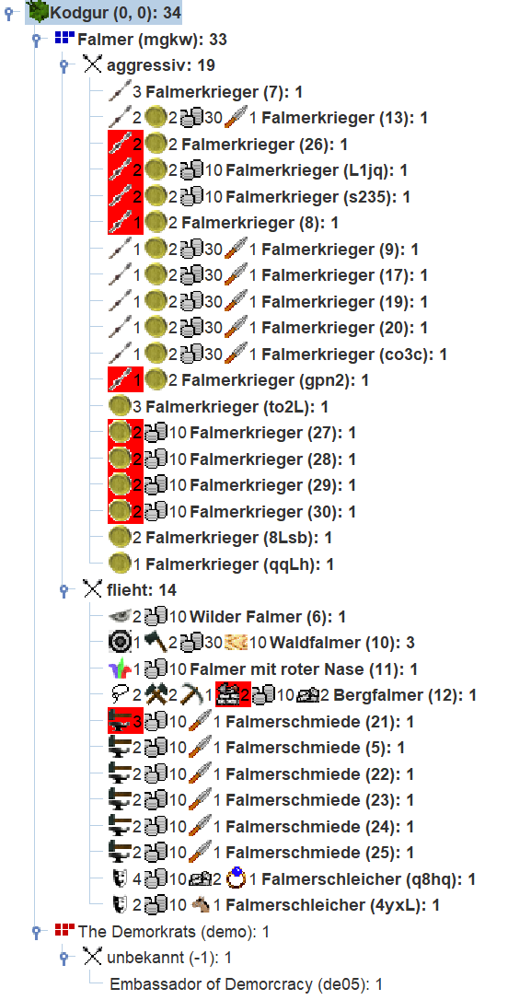
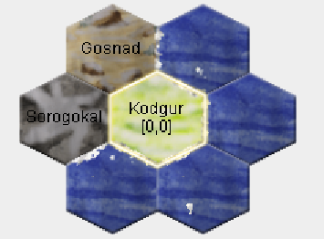

# Runde 6
## Die Auswertung
Die sechste Auswertung ist endlich da. Ein Blick in den nr-Report zeigt das wir noch eine Runde gegen Angriffe immun sind.

Außerdem sehen wir in den Abschnitten `Rohstoffe und Produktion` und `Wirtschaft und Handel` das sich unsere Wirtschaft stetig entwickelt. Wir haben diese Runde 260 Silber verdient und Speere und Holz produziert.

Der Übersicht halber gucken wir uns die Einheiten wieder direkt in Magellan an (durch das Hinzufügen des neuen cr-Reports vom Server werden Talentänderungen wieder rot hervorgehoben):

Wie wir sehen zahlt es sich aus, dass wir viel mit `LERNE AUTO` arbeiten und so meist mit Lehrern arbeiten. Wir haben jetzt schon eine ganze Menge Steuereintreiber Stufe 2 - auch wenn noch nicht alle davon ein Waffentalent beherrschen. Das können wir aber leicht binnen einer Runde ändern und haben ja ohnehin unseren Stangenwaffenlehrer Falmerkrieger (7), so dass die Lerner auch öfters direkt auf Stangenwaffen 2 aufsteigen. Unsere Silberversorgung bildet so auch eine rudimentäre Regionsverteidigung.

Unser Bergfalmer ist dank +1 Bonus direkt auf Burgenbau 2 aufgestiegen. Außerdem ist einer der Schmiede auf Waffenbau 3 aufgestiegen und könnte jetzt weitere Waffen bauen, wie Schwerter und Armbrüste. Der neu rekrutierte Falmerschleicher (4yxL) ist trotz Lehrer mit LERNE AUTO leider nur auf Tarnung 2 gekommen (Goblins haben +1 auf Tarnung). 

Und auch der schweigsame Ork steht nach wie vor in Kodgur rum und bewundert offenbar unseren wirtschaftlichen Aufschwung.

## Der grobe Plan
In Kodgur werden wir weiterhin Bäume fällen und Speere bauen. Damit werden die vorhandenen Steuereintreiber ausgerüstet und neue Falmerkrieger rekrutiert. Außerdem werden wir einen Handelsposten in unserer Heimat bauen, vielleicht werden wir ja doch noch zu Händlern, unseren Silbereinnahmen würde es sicherlich helfen.

Ein weiteres Ziel ist endlich unsere Heimat zu verlassen und die Insel zu erkunden. Daher werden wir diese Runde direkt bewaffnete Scouts in die beiden angrenzenden Regionen Gosnad und Sorogokal senden. Außerdem lassen wir Falmerschleicher (4yxL) Reiten lernen, damit er dann ab nächster Runde die Insel erkunden kann.

## Die Befehle

Die vier der sechs neuen Speere werden an die Falmerkrieger (26), (L1jq), (s235) und (gpn2) verteilt, die auch direkt den Befehl `TREIBE` bekommen. Ein weiterer Speer geht jeweils an Falmerkrieger (27) und (28). Das erscheint erstmal komisch, denn beide haben noch kein Waffentalent. Wir wollen diese beiden aber in die angrenzenden Regionen schicken und daher müssen die schon ihre Waffen mitbringen. Sie können dann vor Ort (ohne Lehrer) Stangenwaffen lernen und in der darauffolgenden Runde Steuern eintreiben. Beide Scouts bekommen insgesamt 30 Silber mit in die fremde Region. Eigentlich würden 20 Silber reichen (1x bewegen, 1x lernen), aber 10 Silber als Puffer Schaden auch nicht. Denn die Regionen könnten z.B. bewacht werden und dann können wir nicht direkt Steuern eintreiben.

    EINHEIT 27;		Falmerkrieger [1,10$]
    ;bestaetigt
    NACH nw
    DEFAULT "LERNE Stangenwaffen"
    // Hochlandscout!
    // Achtung kann noch kein Waffentalent!

    EINHEIT 28;		Falmerkrieger [1,10$]
    ;bestaetigt
    NACH W
    DEFAULT "LERNE Stangenwaffen"
    // Gebirgsscout!
    // Achtung kann noch kein Waffentalent!

Die Einheit Falmerkrieger (8) könnte zwar auch schon 40 Silber eintreiben, aber wir haben eben nur 6 Speere bauen können. Wir geben diesmal der Erkundung den Vorrang. Außerdem haben wir diese Einheit (8) auch schon einmal als `LERNE AUTO`-Lehrer benutzt. Eventuell hatte sie also bereits einen zusätzlichen Lernversuch. Daher versuchen wir unser Glück und lassen die Einheit Steuereintreiben lernen, in der Hoffnung noch auf Stufe 3 zu kommen, ehe sie ihren Speer bekommt: 

    EINHEIT 8;		Falmerkrieger [1,0$]
    ;bestaetigt
    LERNE AUTO Steuereintreiben
    // war Steuerlehrer - hatte also mehr Lernversuche

Die übrigen Einheiten mit Steuereintreiben 2, die keine Waffe bekommen haben bekommen den Befehl `LERNEN AUTO Stangenwaffen` und werden mit eben diesem Befehl bei Einheit Falmerkrieger (7) automatisch gelehrt.

Die Einheit (qqLh) die trotz Lehrer noch nicht aufgestiegen ist lernt weiterhin mit `LERNE AUTO Steuereintreiben`, ebenso wie die Einheit (to2L) mit Steuereintreiben 3. Damit bekommt (qqLh) sicher zwei weitere Lernversuche und erreicht zwingend nächste Runde Stufe 2. Denn 4 Lernversuche reichen dafür in jeden Fall.

Mit den beiden Steinen, die bereits beim Bergfalmer sind, werden wir einen [Handelsposten](https://wiki.eressea.de/index.php/Burg) bauen. Dazu ist Burgenbau 1 nötig. Da wir durch den Rassenbonus Burgenbau 2 haben, können wir in einer Runde zwei Steine verbauen und bauen Grundmauern und Handelsposten in einer Runde.

    EINHEIT 12;		Bergfalmer [1,10$]
    ;bestaetigt
    MACHE BURG 
    // Eisen schonmal keins bis Stufe 4, denn man sieht Talent x2 Schichten
    // nope, auch keine Steine bis T2
    // dann machen wir halt erstmal Pferde...
    // Glück, gehabt. Der PFerdefänger ist mit einer Talentanwendung direkt au\
    f T2 aufgestiegen!

Außerdem machen wir unseren Inselscout startklar und übergeben ihm den Ring der Unsichtbarkeit:

    EINHEIT q8hq;		Falmerschleicher [1,10$]
    ;bestaetigt
    LERNE AUTO Tarnung
    // erstmal bis T4 lernen...
    GIB 4yxL 1 Ring~der~Unsichtbarkeit

und lassen den Scout Falmerschleicher (4yxL) selbst Reiten lernen (`LERNE Reiten`). Das kann hier auch ohne `AUTO` passieren, da wir keine andere Einheit mit dem Talent Reiten haben. 

Die restlichen Einheiten machen unverändert das, was sie schon die ganze Zeit machen (Holz schlagen, Speere bauen, Wahrnehmung lernen und unterhalten).

Mit dem restlichen Silber was wir noch haben, werden wir weiterhin wachsen und rekrutieren drei einzelne Goblins in drei Temp-Einheiten. Wir werden zwei Goblins `LERNE AUTO Steuereintreiben` und dem dritten `LERNE AUTO Bogenschießen` befehlen. Die Temp-Einheit stellen wir auch entsprechend direkt in die zweite [Kampfreihe](https://wiki.eressea.de/index.php/Krieg#Kampfreihen):

    MACHE TEMP 31
    BENENNE EINHEIT "Falmerkrieger"
    REKRUTIERE 1
    GRUPPE
    KÄMPFE HINTEN
    LERNE AUTO Bogenschießen
    ;bestaetigt_temp
    ENDE

Dann können wir zukünftig entscheiden, ob wir unsere Treiber in Stangenwaffen oder Bogenschießen ausbilden wollen. Beide Waffentypen sind mit Waffenbau 2 gleich schwierig, bzw. einfach zu bauen. 

Die Befehle für diese Runde sind damit geschrieben und wir fiebern der nächsten Auswertung entgegen, in der wir endlich mehr von unserer Insel sehen werden.

## Diplomatie

Und siehe da, die Orks geben ein Lebenszeichen:

    Ich grüße die steinetragenden und nicht steinetragenden Untertanen des Trollkönigs!
    Ich grüße die Falmer aus dem Osten!
    (In der Reihenfolge, wie wir sie angetroffen haben)
    
    Ich bin Ork, der schreiben kann. Um ehrlich zu sein, versuchen wir selbst noch herauszufinden, was Demorkratie eigentlich ist. 
    Das Wissen darüber ist leider im letzten Krieg verloren gegangen. Aber was war das für ein Spaß!
    
    Es hat sicher was mit Kämpfen zu tun, so viel ist sicher. Kämpfen tun wir am liebsten. Aber lieber nicht mit Nachbarn. 
    Lieber mit Weiter-weg-Nachbarn.
    Trolle sind stark und Goblins sind gemein, das respektieren wir. Also lasst uns was zusammen machen!
    
    	Die Demorkratie

Das klingt doch ganz gut. Die Orks scheinen jedenfalls nicht auf eine direkte Konfrontation hinaus zu wollen. Und zusätzlich erfahren wir noch von einem Trollvolk ganz in der Nähe, dem wir noch nicht begegnet sind. Trolle sind schlecht in Wahrnehmung, Goblins sind gut in Tarnung. Andererseits könnten wir auch statt die Trolle zu beklauen, versuchen mit Orks und Trollen in der Front eine diebische Schar Bogenschützen in der zweiten Reihe zu stellen und so die Insel erobern. 

Wir antworten erstmal im Sinne der Kooperation, Feinde können wir immer noch werden... Da die Orks uns und die unbekannten Trolle angeschrieben hatten, antworten wir auch direkt an Orks und Trolle. Unser diplomatisches Ziel muss zunächst sein, dass sich nicht Orks und Trolle gegen uns verschwören. Das würde unangenehm werden.

    Wir grüßen die Demorkrats!
    Und wir grüßen die (noch unbekannten) Untertanen des Trollkönigs!
    
    Der Vorschlag zusammen zu arbeiten gefällt den Falmern! Falmer scheuen den Kampf ebenfalls nicht, suchen ihn aber nicht. Wir suchen 
    lieber das Silber in den Taschen unserer Feinde... Kampfstarke Nachbarn wie Trolle und Orks, haben wir daher lieber neben uns anstatt 
    uns gegenüber.
    
    Außerdem hoffen wir, bald auch die Trolle persönlich zu treffen.
    
    (der Brief ist nicht mit einem Namen unterschrieben – es sieht eher nach einem verkrusteten schlammigen Fingerabdruck aus)

Naja, warten wir die nächsten Runden ab, wie sich das ganze entwickelt. Solange wir nicht mehr aufgeklärt haben und wissen wie stark die Nachbarn sind, fahren wir sicher besser wenn wir mit den direkten Nachbarn keinen Streit anfangen. Das hilft am Ende nur den weiter entfernten Nachbarn.
