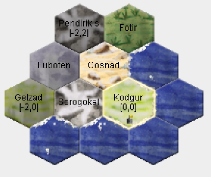
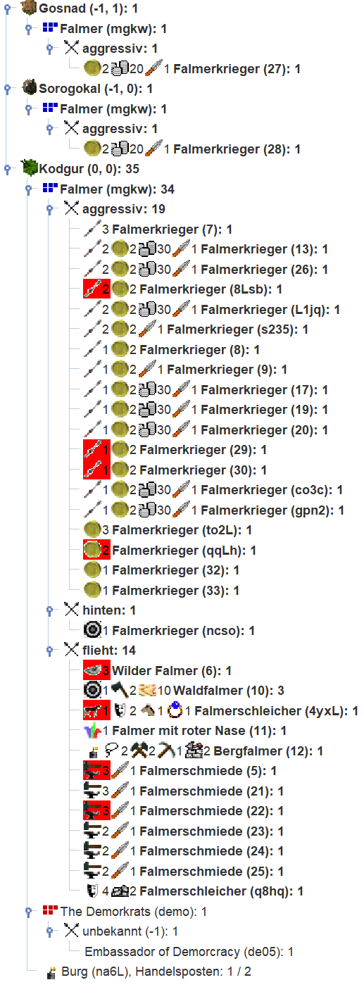
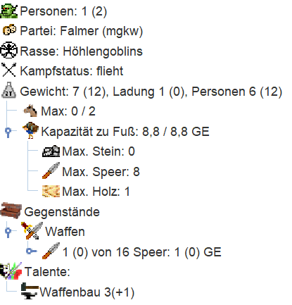

# Runde 7
## Die Auswertung

Auswertung Nummer 7 ist im Posteingang angekommen. Wie immer gilt der erste Blick dem nr-Report:

            Deine Partei hat 36 Personen in 34 von maximal 2500 Einheiten.
 
         Optionen: AUSWERTUNG COMPUTER ZUGVORLAGE STATISTIK ZIPPED ADRESSEN

                                   Hinweise
    
    Deine Partei ist nun nicht mehr immun gegen Angriffe.
    
                               Warnungen und Fehler
    
    Falmerkrieger (co3c) in Kodgur (0,0): '@BEWACHE' - Einheiten einer Partei, die
      noch immun gegen Angriffe ist, dürfen nicht bewachen.
    
                             Rohstoffe und Produktion
    
    Falmerschmiede (5) in Kodgur (0,0) produziert 1 Speer.
    Bergfalmer (12) baut für 2 an Burg (na6L) weiter.
    Falmerschmiede (21) in Kodgur (0,0) produziert 1 Speer.
    Falmerschmiede (22) in Kodgur (0,0) produziert 1 Speer.
    Falmerschmiede (23) in Kodgur (0,0) produziert 1 Speer.
    Falmerschmiede (24) in Kodgur (0,0) produziert 1 Speer.
    Falmerschmiede (25) in Kodgur (0,0) produziert 1 Speer.
    Waldfalmer (10) in Kodgur (0,0) produziert 6 Holz.
    
                               Wirtschaft und Handel
    
    Falmer mit roter Nase (11) verdient in Kodgur (0,0) 20 Silber durch
      Unterhaltung.
    Falmerkrieger (9) verdient in Kodgur (0,0) 40 Silber durch Steuern.
    Falmerkrieger (L1jq) verdient in Kodgur (0,0) 40 Silber durch Steuern.
    Falmerkrieger (13) verdient in Kodgur (0,0) 40 Silber durch Steuern.
    Falmerkrieger (gpn2) verdient in Kodgur (0,0) 40 Silber durch Steuern.
    Falmerkrieger (17) verdient in Kodgur (0,0) 40 Silber durch Steuern.
    Falmerkrieger (co3c) verdient in Kodgur (0,0) 40 Silber durch Steuern.
    Falmerkrieger (19) verdient in Kodgur (0,0) 40 Silber durch Steuern.
    Falmerkrieger (20) verdient in Kodgur (0,0) 40 Silber durch Steuern.
    Falmerkrieger (26) verdient in Kodgur (0,0) 40 Silber durch Steuern.
    
                                 Reisen und Bewegung
    
    Falmerkrieger (27) wandert von Kodgur (0,0) nach Gosnad (-1,1).
    Falmerkrieger (28) wandert von Kodgur (0,0) nach Sorogokal (-1,0).

Wir sehen also den wichtigen Hinweis, dass wir ab jetzt nicht mehr vor Angriffen geschützt sind. Außerdem haben wir scheinbar bei Einheit (co3c) vergessen das `!` vor das `@BEWACHE` zu schreiben, um die Fehlermeldung zu unterdrücken. Egal, wegen der geendeten Immunität sollten wir den Fehler ab nächster Runde sowieso nicht mehr sehen.

Unsere Wirtschaft wächst und gedeiht weiter. Die Waffenproduktion läuft und wir haben 380 Silber eingenommen. Unsere Partei hat 36 Personen, die jede Runde 360 Silber verbrauchen. Wir haben also in Runde 7 erstmals den Punkt erreicht, in dem wir endlich mehr Silber verdienen als wir ausgeben.

Außerdem haben wir ja unsere Falmerkrieger ausgesendet das Hochland und die benachbarten Berge zu besuchen. Zumindest die Bewegung hat geklappt. Jetzt sind wir natürlich neugierig, wie diese Regionen aussehen und wer dort schon lebt. Springen wir also direkt zu diesen Regionen: 

    ------------------------------------------------------------------------------
    
    Sorogokal (-1,0), Berge, 597 Bauern, 37121 Silber, 7 Pferde. Im Nordwesten der
    Region liegt der Gletscher von Fuboten (-2,1), im Nordosten das Hochland von
    Gosnad (-1,1), im Osten die Ebene von Kodgur (0,0), im Südosten Ozean (0,-1),
    im Südwesten Ozean (-1,-1) und im Westen die Ebene von Gelzad (-2,0).
    
    Auf dem Markt wird für Gewürze 5 Silber verlangt. Geboten wird für Balsam 8
    Silber, für Juwelen 35 Silber, für Myrrhe 10 Silber, für Öl 12 Silber,
    für Seide 24 Silber und für Weihrauch 8 Silber.
    
    Statistik für Sorogokal (-1,0):
    
      Unterhaltung: max. 1856 Silber
      Lohn für Arbeit: 10 Silber
      Rekruten: max. 14 Bauern
      Luxusgüter zum angegebenen Preis: 5
      Personen: 1
      Silber: 20
      Speere: 1
    
      * Falmerkrieger (28), 1 Höhlengoblin, aggressiv, Talente: Steuereintreiben
        2, hat: 20 Silber, Speer, "LERNE Stangenwaffen".

Sehr schön, außer uns ist aktuell niemand im Berg. Wir haben zwar keinen Wahrnehmer vor Ort, aber hoffen wir einfach mal, dass hier keine getarnten Einheiten rum stehen. Mit knapp 600 Bauern ist der Berg auch eine gute Region, in der wir zusätzliches Silber verdienen können. Leider gibt es hier keine Bäume. Eisen und Steine werden wir hier aber sicher finden.

Sehen wir uns als nächstes das Hochland an:

    ------------------------------------------------------------------------------
    
    Gosnad (-1,1), Hochland, 1694 Bauern, 99022 Silber, 3 Pferde. Im Nordwesten
    der Region liegt das Bergland von Pendirikis (-2,2), im Nordosten der Sumpf
    von Fotir (-1,2), im Osten Ozean (0,1), im Südosten die Ebene von Kodgur
    (0,0), im Südwesten das Bergland von Sorogokal (-1,0) und im Westen der
    Gletscher von Fuboten (-2,1).
    
    Auf dem Markt wird für Weihrauch 4 Silber verlangt. Geboten wird für Balsam
    20 Silber, für Gewürze 15 Silber, für Juwelen 21 Silber, für Myrrhe 10
    Silber, für Öl 12 Silber und für Seide 42 Silber.
    
    Statistik für Gosnad (-1,1):
    
      Unterhaltung: max. 4951 Silber
      Lohn für Arbeit: 10 Silber
      Rekruten: max. 42 Bauern
      Luxusgüter zum angegebenen Preis: 16
      Personen: 1
      Silber: 20
      Speere: 1
    
      * Falmerkrieger (27), 1 Höhlengoblin, aggressiv, Talente: Steuereintreiben
        2, hat: 20 Silber, Speer, "LERNE Stangenwaffen".

Und wieder sehen wir sonst niemanden in der Region. Und auch diese Region ist mit knapp 1700 Bauern und knapp über 99000 Silber im Regionspool eine schöne Erweiterung unserer Falmerländereien. Außerdem spielen uns die angebotenen Luxusgüter in die Karten. In Sorogokal können wir Gewürze einkaufen, in Gosnad wird Weihrauch angeboten und unsere Heimat Kodgur bietet Juwelen. Hier könnte man sich also ein kleines Handelsnetz über drei Regionen vorstellen, das zusätzliches Silber generiert.

Unsere neue Weltkarte sehen wir sobald wir den cr-Report in Magellan hinzufügen: 

Wir sehen dass es westlich des Berges eine weitere Ebene gibt. Vermutlich leben die Orks oder die Trolle hier. Außerdem gibt es einen weiteren Berg ganz in der Nähe. Wenn wir uns mit den Nachbarn einig werden oder diese andersweitig überzeugen können, sollte es uns weder an Steinen noch an Eisen mangeln.

In Kodgur sehen wir auf der Karte ein neues Symbol: ein kleiner Turm mit gelber Flagge. Dies zeigt an, dass hier nun ein Burgentyp steht. Diesen finden wir auch im nr-Report, wo wir nochmal nachgucken:

      Burg (na6L), Größe 2, Handelsposten.

        * Bergfalmer (12), 1 Höhlengoblin, flieht, Talente: Bergbau 2, Burgenbau
          2, Pferdedressur 2, Steinbau 1, "MACHE Burg na6L".

Die übrigen Einheiten und Talentveränderungen gucken wir uns wiederum in Magellan an. Dabei sehen wir, dass die Ausbildung unserer Steuereintreiber gut vorankommt. Bei den Schmieden sind weitere Einheiten auf Waffenbau 3 aufgestiegen. Weiter ist unser Wahrnehmer aufgestiegen und der berittene Scout ist startbereit.

## Der grobe Plan

In Kodgur werden wir nicht viel ändern. Wir werden weiterhin Speere bauen und mit dem Silber das wir den Bauern abnehmen neue Steuereintreiber rekrutieren und ausbilden. Die kleine Burg hier werden wir vorerst nicht weiter ausbauen, mit einem Handelsposten kann man Handeln. Mit den zwei Steine die wir noch übrig haben, können wir eventuell im Hochland Gosnad einen weiteren Handelsposten bauen. Aber dafür brauchen wir erst mehr Transportkapazität, Steine wiegen 60 GE. Dazu brauchen wir deutlich mehr Pferde und Reiter oder wir müssten statt Speere das Holz mal für einen Wagen investieren. Da wir keine Händler haben, bauen wir lieber erstmal weiter Waffen. Der Bergfalmer wird jedenfalls erstmal in den Berg ziehen. Dann sehen wir wieviel Steine und Eisen es hier gibt und können ohne Steine transportieren zu müssen hier einen weiteren Handelsposten bauen, wenn wir das möchten.

Im Hochland Gosnad gibt es diese Runde nicht viel zu tun, außer die Region zu bewachen und den Falmerkrieger dort Stangenwaffen lernen zu lassen. Wir können schon in dieser Runde befehlen zu bewachen, obwohl wir erst Stangenwaffen lernen. Den Speer haben wir ja extra mitgebracht. Ab nächster Runde werden wir die Region dann direkt bewachen und der Falmerkrieger soll dann dort Steuern eintreiben.

Den Berg Sorogokal wollen wir uns aber nachhaltig sichern. Das hier noch kein Nachbar sich breit gemacht hat, wollen wir ausnutzen. Ein Berg sollte man eigentlich immer besitzen. Das Eisen das dort Berg liegt, wird uns viele neue Waffen und Rüstungen garantieren, auch wenn das Holz in Kodgur langsam weniger wird. Außerdem brauchen die meisten Gebäude Eisen und Steine. Gebäude werden wir zwar erst in einigen Runden bauen, aber ein Sägewerk für Kodgur, und einen Steinbruch und ein Bergwerk in Sorogokal wäre mittelfristig schon sehr sinnvoll. Daher werden wir überlegen, was wir in Kodgur entbehren und in das Gebirge schicken können, um unsere Position hier zu festigen. In dem Berg selbst werden wir - wie im Hochland - aber nur Stangenwaffen lernen und direkt die Region bewachen. 

## Die Befehle

Wir beginnen mit den Befehlen für das Hochland und den Berg. Hier gibt es wie beschrieben nicht viel zu tun.
Im Berg Sorogokal lernen wir Stangenwaffen und bewachen dauerhaft die Region.

    REGION -1,0 ; Sorogokal
    ; ECheck Lohn 11
    EINHEIT 28;		Falmerkrieger [1,20$]
    ;bestaetigt
    LERNE Stangenwaffen
    @BEWACHE
    // Gebirgsscout!
    // Achtung kann noch kein Waffentalent!

Und die Befehle im Hochland sind identisch mit den Befehlen in Sorogokal:

    REGION -1,1 ; Gosnad
    ; ECheck Lohn 11
    EINHEIT 27;		Falmerkrieger [1,20$]
    ;bestaetigt
    LERNE Stangenwaffen
    @BEWACHE
    // Hochlandscout!
    // Achtung kann noch kein Waffentalent!

Das permanente Kommentar, dass wir kein Waffentalent haben können wir dann nächste Runde entfernen. Es war für uns eine Gedankenstütze, damit wir nicht aus versehen direkt `TREIBEN` und dann nächste Runde eine Fehlermeldung bekommen.

In Kodgur gibt es diese Woche deutlich mehr zu erledigen. Um die Übersicht etwas zu verbessern, werden wir die Treiber etwas zusammenlegen. Dabei werden wir aber darauf achten, dass wir nur Einheiten mit gleichen Talenten zusammen legen werden. Aber das Zusammenlegen von Einheiten kann auch zu mehr Produktion führen, wie wir an den Schmieden verdeutlichen werden.

Falmerschmied (22) und Falmerschmied (5) sind beide diese Runde auf Waffenbau 3 aufgestiegen. Ein Speer benötigt Waffenbau 2 um gebaut zu werden. Das bedeutet jeder der beiden Schmiede kann weiterhin alleine nur einen Speer machen; und verschenkt dabei einen weiteren Punkt Waffenbautalent ungenutzt. Wenn wir aber die beiden Schmiede in eine Einheit zusammenfassen, dann haben wir eine Einheit mit 2 Personen mit Waffenbau 3. Diese Einheit ist in der Lage Speere zu bauen, da ihr Waffentalent besser als Stufe 2 ist. Außerdem hat sie jetzt 2x3 Waffenbaupunkte, wodurch sie 3 Speere bauen kann (6 geteilt durch 2). Statt zwei mal einen Speer, können die zusammengelegten Schmiede also direkt 3 Speere bauen.

Wir befehlen Falmerschmiede (5) also den Bau von Speeren und verteilen den Speer von letzter Runde: 

    EINHEIT 5;		Falmerschmiede [1,0$]
    ;bestaetigt
    MACHE Speer
    GIB 8Lsb 1 Speer
 
Bei Einheit (22) geben wir ebenfalls den Speer an eine Treiber-Einheit und übergeben mit `GIB` ausserdem eine Person an Einheit (5). Einen langen Befehl könnten wir zwar setzen, aber es wäre niemand mehr in der Einheit um ihn auszuführen. Denn in der [Befehlsreihenfolge](https://wiki.eressea.de/index.php/Befehlsreihenfolge) kommt `GIB` vor `MACHE`. Daher sparen wir uns den langen Befehl bei Einheit (22). 

    EINHEIT 22;		Falmerschmiede [1,0$]
    ;bestaetigt
    GIB 5 1 PERSONEN
    GIB 8 1 Speer

Wenn wir in Magellan Einheit Falmerschmiede (5) anwählen, nachdem wir die Befehle bei Einheit (22) gesetzt haben, dann sehen wir in den "Details" der Einheit bereits, dass die Schmiede schon als 2 Personen verstanden werden. Die Werte in den runden Klammern bei "Personen" und "Gewicht" berücksichtigen schon die gesetzten Befehle. Auch die Kapazität der Einheit hat sich auf 8,8 GE erhöht.  

Auch bei den Steuereintreibern werden wir Einheiten zusammenlegen. Dabei werden wir aber nur Einheiten mit denselben Talentwerten zusammenfügen. Die beiden Treiber mit Steuereintreiben 1 sollen einzeln weiter lernen, ebenso wie der Falmerkrieger (to2L) mit Steuereintreiben 3. Außerdem machen wir wieder neue Rekruten, die ebenfalls mit `LERNE AUTO Steuereintreiben` von dem Lehrer profitieren sollen.

Die Falmerkrieger mit Steuereintreiben 2 wollen wir zusammenfassen. Man sieht an den Talentwerten, dass es zwei Gruppen Steuereintreiber gibt, mit Stangenwaffen 1 und auf Stufe 2. Wie werden daher nur Einheiten mit demselben Waffentalent mischen. Ansonsten würden am Ende nur Einheiten mit Stangenwaffen 1 entstehen, da der Eressea-Server hier zum Nachteil der Spieler abrundet.  

Alle Einheiten mit Stangenwaffen 2 und Steuereintreiben 2 werden wir an Falmerkrieger (8Lsb) übergeben. Wir geben also bei 4 anderen Einheiten die Übergabe-Befehle an (8Lsb). Das passiert genau wie bei dem Beispiel mit den Schmieden. Hier die Befehle für Einheit (13) im Detail:

    EINHEIT 13;		Falmerkrieger [1,30$]
    ;bestaetigt
    GIB 8 30 Silber
    GIB 8Lsb ALLES 
    GIB 8Lsb ALLES PERSONEN 

Die Reihenfolge der `GIB`-Befehle ist hier entscheidend.
Die Einheit gibt 30 Silber an Falmerkrieger (8), und *danach* gibt sie `ALLES` was sie noch hat and Falmerkrieger (8Lsb). In diesem Fall ist `ALLES` exakt 1 Speer. Denn außer Silber und dem Speer hatte die Einheit nichts. Wenn die Befehle stattdessen gelautet hätten: 

    EINHEIT 13;		Falmerkrieger [1,30$]
    ;bestaetigt
    GIB 8Lsb ALLES 
    GIB 8 30 Silber
    GIB 8Lsb ALLES PERSONEN 

Dann hätte Einheit (uLsb) sowohl den Speer als auch die 30 Silber bekommen. Der zweite `GIB`-Befehl hätte nur bedient werden können, wenn im Silberpool der Region noch 30 Silber frei gewesen wären, d.h. nicht durch `GIB` oder `RESERVIERE` bei einer anderen Einheit reserviert wären. Silberübergaben aus dem Silberpool können gefährlich sein, insbesondere wenn man Einheiten aus der Region bewegt. Wenn es doof läuft, nimmt der Silberpool es gerade diesen Einheiten weg, die dann ohne Silber in eine andere Region laufen und dort eventuell hungern, wenn sie vor Ort nicht versorgt werden können. 

Wichtig zu verstehen ist auch, dass sich `GIB ALLES` nur auf die Gegenstände bezieht, die die Einehit trägt. Will man die Personen ebenfalls in eine andere Einheit übergeben muss man dies explizit mit `GIB 8Lsb ALLES PERSONEN` was in diesem Fall gelichbedeutend mit `GIB 8Lsb 1 PERSONEN` wäre.

Aber wie legen noch weiter zusammen: Wir übergeben Einheit (9), (29) und (30) and Einheit (8). Alle 4 Einheiten haben Stangenwaffen 1 und Steuereintreiben 2, so dass wir ohne Verluste zusammenfügen können. Einheit (9) übergibt zusätzlich noch ihren Speer an Einheit (8) und zwei der Schmiede rüsten Falmerkrieger (8) ebenfalls mit zwei weiteren Speeren aus. Dadurch ensteht Einheit Falmerkrieger (8), die aus 4 Goblins besteht und 4 Speere hat. Wir wollen diese neu formierte Einheit in den Berg `NACH W` schicken. 

Im Berg haben wir aber noch kein Silbereinkommen. Daher ist es wichtig, dass die Falmerkrieger (8) Silber mitnehmen in den Berg. Denn sie werden ein eWoche laufen und dabei natürlich auch 10 Silber je Goblin brauchen. Sonst kommen sie hungernd im Berg an und werden durch den Hunger Talentverlust leiden. Das wollen wir natürlcih vermeiden. Daher geben wir Einheit (8) 40 Silber als Wegproviant mit. Sie wird dann nächste Runde ohne Silber im Berg stehen. Aber die Einheit kann ja nächste Runde im Berg direkt Steuern eintreiben.

Die verbleibenden 5 Steuereintreiber Stufe 2 mit Stangenwaffen 1 fassen wir in Einheit Flamerkrieger (17) zusammen. Dabei achten wir wieder sorgfältig darauf, dass wir Personen und Speere übergeben. Falmerkrieger (17) befehlen wir ja direkt weiter Steuern einzutreiben. Das geht aber nur, wenn jede Person der Einheit auch bewaffnet ist.

Wie schon erwähnt, geschiet das Zusammenfügen der Einheiten nur für eine bessere Übersicht. Das Einheitenlimit liegt mit 2500 Einheiten in weiter Ferne und wir hätten weiterhin darauf spekulieren können, dass durch die einzelnen 1er-Einheiten hier und da eventuell eine Person schneller aufsteigt und als Lehrer dienen könnte. Der Vorteil des Zusammenlegens ist aber, dass wir zukünftig in Kodgur nur die zwei Einheiten Falmerkrieger (8Lsb) und Falmerkrieger (17) haben werden, die Silber generieren. Das macht manuelle Silberübergaben leichter, wenn man nicht an mehreren Stellen 10 Silber übergeben muss, um eine neue Temp-Einheit mit dem Rekrutierungssilber zu versorgen.

Sicherlich könnte man sich auch hier wieder auf den Silberpool der Region verlassen und hoffen, dass das Silber von den richtigen Einheiten genommen wird. Solange man aber kein komfortables Silberpolster in der Region hat, ist es ratsam Silberübergaben explizit zu setzen. Die Gefahr das eine Einheit ungewollt hungert ist sonst größer.

Zu guter Letzt geben wir Bergfalmer (12) noch 10 Silber und schicken ihn ebenfalls in den Berg `NACH W`. Er wird dann dort auch ohne Silber ankommen, wird dann aber in den kommenden Runden von den Falmerkriegern (8) durch deren Steuereinnahmen versorgt. 

Außerdem senden wir unseren mit Ring der Unsichtbarkeit getarnten Reiter Falmerschleicher (4yxL) los. Die Ebene Gelzad im Westen jenseits des Bergs ist ein erstes interessantes Ziel. Wir vermuten hier die Heimat der Orks oder der noch unbekannten Trolle. Als nächstes könnte es interessant sein, den Berg Pendirikis im NW unserer aktuellen Weltkarte zu besuchen. Wir setzen daher schonmal den `DEFAULT` Befehl. Wenn wir nächste Woche den Plan ändern wollen können wir das leicht tun.   

    EINHEIT 4yxL;		Falmerschleicher [1,0$]
    ;bestaetigt
    NACH W W
    DEFAULT "NACH NO NO" 
    // soll dann scouten und mal die Insel erkunden - vermutlich mit RdU. Muss \
    ja nicht jeder wissen, dass wir vor Ort sind...   

Der Falmerschleicher (4yxL) wird einige Zeit in fremden Landen unterwegs sein. Daher geben wir ihm auch noch 30 Silber mit. Mehr wollen wir nicht entbehren, um das Wachstum in Kodgur und die Besiedelung des Bergs Sorogokal nicht zu bremsen. 
