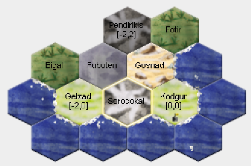
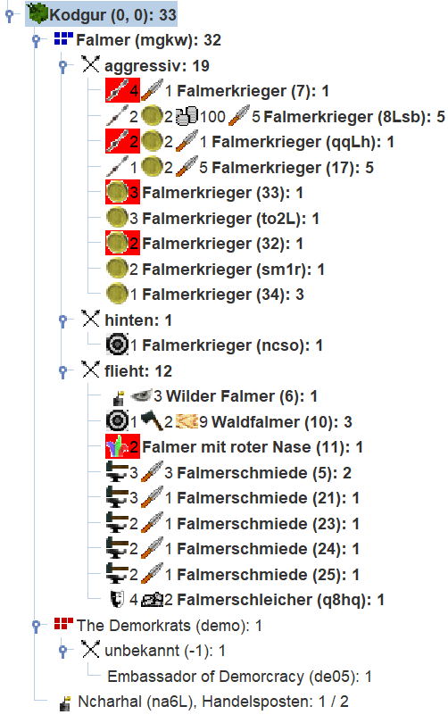

# Runde 8
## Die Auswertung

Auswertung Nummer 8 ist da. Wir gucken zunächst in den nr-Report.
Den Anfang des Reports lesen wir gründlich, überspringen ihn hier aber,
und blicken direkt in die Regionsdetails. 

Unser Scout hat die Ebene im Westen erreicht. Und wir sehen, dass dies die Heimat der Orks ist. Wir zählen 34 Orks mit 29 Speeren. Es scheint die Orks hätten eine ganz ähnliche Startstrategie wie wir gewählt und sich erstmal auf speertragende Steuereintreiber in der Startregion konzentriert.
```
    ------------------------------------------------------------------------------
    
    Gelzad (-2,0), Ebene, 474/100 Bäume, 4017 Bauern, 109738 Silber, 57 Pferde.
    Im Nordwesten der Region liegt der Sumpf von Bigal (-3,1), im Nordosten der
    Gletscher von Fuboten (-2,1), im Osten das Bergland von Sorogokal (-1,0), im
    Südosten Ozean (-1,-1), im Südwesten Ozean (-2,-1) und im Westen Ozean
    (-3,0).
    
    Auf dem Markt wird für Juwelen 7 Silber verlangt. Geboten wird für Balsam 20
    Silber, für Gewürze 15 Silber, für Myrrhe 10 Silber, für Öl 6 Silber,
    für Seide 18 Silber und für Weihrauch 24 Silber.
    
    Die Region wird von The Demorkrats (demo) bewacht.
    
    Statistik für Gelzad (-2,0):
    
      Unterhaltung: max. 5486 Silber
      Lohn für Arbeit: 10 Silber
      Rekruten: max. 100 Bauern
      Luxusgüter zum angegebenen Preis: 40
      Personen: 1
      Pferde: 1
      Silber: 20
      Ringe der Unsichtbarkeit: 1
    
      - First Demorkrat (demo), The Demorkrats (demo), 1 Ork; We are for
        separation of power. So let's separate the power fro you.
    
      - demorcratic bureorcrat (de00), The Demorkrats (demo), 1 Ork.
    
      - artisans (de01), The Demorkrats (demo), 1 Ork.
    
      - Guardian of Demorcracy (de03), The Demorkrats (demo), 1 Ork.
    
      - Miner (de06), The Demorkrats (demo), 1 Ork; As in: This land is mine!
    
      - miner (de07), The Demorkrats (demo), 1 Ork; As in: This land is mine!
    
      - landscaper (de08), The Demorkrats (demo), 2 Orks, hat: 7 Holz.
    
      - tax orcficials (de10), The Demorkrats (demo), 10 Orks, bewacht die Region,
        hat: 10 Speere.
    
      - tax orcficials (de0c), The Demorkrats (demo), 3 Orks, hat: 3 Speere.
    
      - artisans (de0b), The Demorkrats (demo), 3 Orks, hat: 7 Speere.
    
      - tax orcficials (de0d), The Demorkrats (demo), 2 Orks, hat: 2 Speere.
    
      - tax orcficials (de0e), The Demorkrats (demo), 1 Ork, hat: Speer.
    
      - tax orcficials (de0f), The Demorkrats (demo), 1 Ork, hat: Speer.
    
      - tax orcficials (de0g), The Demorkrats (demo), 1 Ork, hat: Speer.
    
      - tax orcficials (de0h), The Demorkrats (demo), 1 Ork.
    
      - tax orcficials (de0i), The Demorkrats (demo), 1 Ork, hat: Speer.
    
      - tax orcficials (de0j), The Demorkrats (demo), 1 Ork, hat: Speer.
    
      - tax orcficials (de0k), The Demorkrats (demo), 1 Ork, hat: Speer.
    
      - tax orcficials (de0L), The Demorkrats (demo), 1 Ork, hat: Speer.
    
      * Falmerschleicher (4yxL), 1 Höhlengoblin, flieht, Talente: Reiten 1,
        Tarnung 2, hat: Pferd, 20 Silber, Ring der Unsichtbarkeit.
```
Durch den Ritt nach Gelzad hat sich auch unsere Sicht auf die Insel vergrößert. Es scheint wir sind am südlichen Teil der Insel angesiedelt.



Auch ein Blick auf den Berg Sorogokal gibt uns neue Erkenntnisse, denn wir hatten unseren Bergfalmer(12) aus Kodgur hierher gezogen. Da dieser sowohl Steinbau als auch Bergbau beherrscht, sehen wir, dass es im Berg auf ersten Stufe 50 Eisen und 68 Steine zum Abbau gibt. Die Zahl hinter dem `/` gibt an, welches Mindestalent für den Abbau nötig ist. Wenn z.B. die 68 Steine auf der ersten Schicht abgebaut sind, wird man sehen, wieviele Steine sich auf der zweiten Gesteinsschicht befinden. Für deren Abbau ist dann allerdings Steinbau 2 nötig. Beim Eisen verhält es sich analog. 

Die Orks sind immer noch nicht im Berg und dieser wird jetzt auch offiziell von uns beansprucht: `Die Region wird von Falmer (mgkw) bewacht.` Das sehen wir auch direkt an unserer Einheit Falmerkrieger (28), bei der jetzt steht `bewacht die Region`. Ohne unsere Erlaubnis wird hier niemand Ressourcen abbauen. Dazu müsste er unseren Bewacher schon tot hauen.  

Außerdem sehen, wir dass unsere 4 Felmerkrieger, die wir letzte Woche zusammengelegt haben erfolgreich in den Berg gelaufen sind.
```
    ------------------------------------------------------------------------------
    
    Sorogokal (-1,0), Berge, 50 Eisen/1, 68 Steine/1, 598 Bauern, 37708 Silber, 9
    Pferde. Im Nordwesten der Region liegt der Gletscher von Fuboten (-2,1), im
    Nordosten das Hochland von Gosnad (-1,1), im Osten die Ebene von Kodgur (0,0),
    im Südosten Ozean (0,-1), im Südwesten Ozean (-1,-1) und im Westen die Ebene
    von Gelzad (-2,0).
    
    Auf dem Markt wird für Gewürze 5 Silber verlangt. Geboten wird für Balsam 8
    Silber, für Juwelen 35 Silber, für Myrrhe 10 Silber, für Öl 12 Silber,
    für Seide 30 Silber und für Weihrauch 8 Silber.
    
    Die Region wird von Falmer (mgkw) bewacht.
    
    Die Region wurde durchquert von Falmerschleicher (4yxL).
    
    Statistik für Sorogokal (-1,0):
    
      Unterhaltung: max. 1885 Silber
      Lohn für Arbeit: 10 Silber
      Rekruten: max. 14 Bauern
      Luxusgüter zum angegebenen Preis: 5
      Personen: 6
      Silber: 10
      Speere: 5
    
      * Falmerkrieger (28), 1 Höhlengoblin, aggressiv, bewacht die Region,
        Talente: Stangenwaffen 1, Steuereintreiben 2, hat: 10 Silber, Speer,
        "LERNE Stangenwaffen".
    
      * Bergfalmer (12), 1 Höhlengoblin, flieht, Talente: Bergbau 2, Burgenbau 2,
        Pferdedressur 2, Steinbau 1, "MACHE Burg na6L".
    
      * Falmerkrieger (8), 4 Höhlengoblins, aggressiv, Talente: Stangenwaffen 1,
        Steuereintreiben 2, hat: 4 Speere, "LERNE AUTO Steuereintreiben".
```
Auf unsere Heimat blicken wir wieder mit der Magellan-Ansicht. Es ist aber wichtig dass wir auch den nr-Report gründlich ansehen. Denn z.B. die Reihenfolge der Einheiten in der Region haben wir in Magellan ja bewusst nach Kampfstatus unterteilt. Die Reihenfolge im nr-Report ist aber maßgeblich, wenn es z.B. um die Abarbeitung der Befehle in der Region gilt. 



Unser Silbereinkommen wurde hier von 10 Treibern sicher gestellt, die zusammen 400 Silber vedient haben. Mit den 7 Speeren, die wir produziert haben, können wir weitere Treiber ausrüsten und so bald mehr Silber verdienen. Außerdem ist unser Falmer mit roter Nase (11) endlich auf Unterhaltung 2 aufgestiegen. Damit haben wir nun einen Lehrer für Unterhaltung mit dem wir binnen 2 Runden 10 Goblins garantiert zu Unterhaltung 1 ausbilden können. Denn durch den Lehrer haben rekruten jede Runde 2 Lernversuche. Also selbst mit Würfelpack und der maximal nötigen Anzahl an Lernversuchen, werden 4 Lernversuche immer reichen um trotz Malus auf Stufe 1 zu kommen.

Da wir diese Runde mehr Holz zu Speeren verbaut haben, als wir neue Bäume gefällt haben, ist außerdem erstmals unser Holzvorrat um 1 Holz gesunken. Das sollte uns aber nicht beunruhigen, die Holzfäller steigen sicher bald auf, wenn sie weiterhin jede Runde Holz schlagen.  

## Der grobe Plan

Im Hochland Gosnad werden diese Runde Steuern eingetrieben. Und der Scout mit RdU in der Orkheimat, wird wohl den zweiten Berg erkunden. Eventuell können wir uns hier noch einen Berg sichern.

In unserem Berg Sorogokal werden wir natürlich auch Steuern eintreiben. Mit dem Silber, sollte hier schnellstens ein Wahrnehmer rekrutiert werden. Der Bergfalmer (12) soll mit `MACHE Eisen` kostbares Eisen abbauen. Dank Bergbau 2 werden wir dadurch jede Runde 2 Eisen aus dem Berg schlagen können. In Kodgur haben wie noch einen einzelnen Schmied mit Waffenbau 3. Diesen können wir nach Sorogokal holen dann kann er hier Schwerter produzieren. Jedes Schwert sollte direkt wieder in einen Steuereintreiber investiert werden, um unser Silbereinkommen auszubauen und unsere Kampfkraft zu erhöhen. Wir wissen immer noch nicht, wie freundlich die Orks, Trolle und sonstige Nachbarn sind. Wenn wir wehrhaft sind, wird das aber sicherlich nicht von Nachteil für unsere diplomatischen Verhandlungen sein.  

In unserer Heimat Kodgur werden wir die Strategie bei behalten. Wir schlagen weiter Bäume und bauen Waffen daraus. Das Silber das wir als Überschuss eintreiben, werden wir wieder in Treiber investieren und so weiter wachsen. 

Durch den Goblin mit Unterhaltung 2 haben wir eine neue Option gewonnen. Vorher brauchte es zwei Runden um einen fertigen Steuereintreiber auszubilden - eine Runde für Steuereintreiben, eine Runde für ein Waffentalent. Jetzt können wir binnen zwei Runden auch Unterhalter ausbilden. Der Vorteil von Unterhaltern ist, dass diese keine Waffe brauchen und außerdem besser werden während sie Silber verdienen. Der Nachteil ist, dass sie nicht als Miliz zu gebrauchen sind und auch die Region nicht bewachen können. Da wir außerdem keinen Malus auf Waffentalente und Steuereintreiben haben, können unsere Treiber dank Lehrer manchmal innerhalb einer Woche direkt auf Stufe 2 aufsteigen.

Solange wir mindestens so viele Waffen pro Woche bauen, wie wir neue Goblins anwerben können, ergibt es für uns Sinn bei Steuereintreibern zu bleiben.  

## Der Ausblick

Das Tutorial der Goblin-Falmer endet hier. Unser Volk hat die Anfangsphase gut überstanden. Wir erwirtschaften ab jetzt in allen Regionen mehr Silber als wir verbauchen. Ab jetzt stehen verschiedene Wege offen.

Wir könnten versuchen enger mit den Trollen und Orks zu kooperieren und versuchen mit ihnen ein (militärisches) Bündnis zu schließen und versuchen mindestens den Süden der Insel unter Kontrolle unserer drei Völker zu bringen. Das ginge wohl auch nur mit einem der beiden Völker und man könnte sich gegen das dritte wenden. Das hängt von unserem diplomatischen Geschick ab. In jedem Fall sollten wir weiter aufrüsten und viele Waffen bauen. Denn wir wollen nicht, dass Orks und Trolle auf die Idee kommen sich gegen uns zu wenden.

Eine friedlichere Option wäre es, wenn wir versuchen im Berg und im Hochland möglichst bald einen Handelsposten zu errichten. Es würde zwar wegen dem -1 Malus ein paar Wochen dauern bis wir Händler auf Stufe 1 haben, aber dank der Juwelen in Kodgur können wir so leicht größere Gewinne erzielen, wenn wir die drei Regionen vernetzen. Parallel sollten wir die Insel nach weiteren Völkern absuchen und neue Kontakte schließen.

Ein weiteres Betätigungsfeld ist sicher die Magie! Da Goblins mit -1 auf Magie starten, haben wir das hier bewusst gar nicht angefangen. Die Investition bis wir endlich Magie 1 erreicht hätten, wäre sehr teuer gewesen. Statt dessen haben wir das Silber in Treiber und Waffen investiert. Dennoch sollten wir nicht zu lange warten, ehe wir mit der Ausblidung eines Magiers beginnen. Vermutlich macht es Sinn, erstmal nur einen Magier auszubilden und auf Stufe 2 zu bringen. Dieser kann die nächsten 4 Magier lehren und wir sparen deutlich an Lernkosten. 

Es gibt diverse Möglichkeiten, wie man diese Goblinpartei weiter spielen kann. Der Grundstein ist jedenfalls gelegt. Viel Erfolg!
